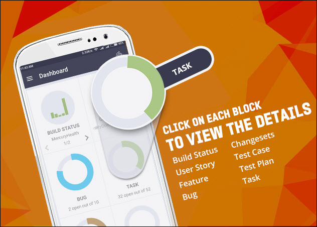

#[SmartTFS for VSTS](https://play.google.com/store/apps/details?id=com.canarys.smart.tfs) 
[Canarys Automations Private Limited](https://play.google.com/store/apps/developer?id=Canarys+Automations+Private+Limited)

> <b>Works with only Visual Studio Team Services (VSTS)</b>

The ultimate app for the executives on the move is here. Now you can now
track the status of your projects hosted on Microsoft Visual Studio Team
Services (VSTS) right from your mobile phone and stay informed.

This is the first release of the new version of the app and does not
need oData configuration. More features will be added soon. Stay tuned.

##Features:  
  • Beautiful dashboard with key metrics represented graphically  
  • Switch and work with multiple accounts, projects, teams and iterations
    seamlessly  
  • View build status for the various build definitions in the project  
  • View the changesets created by your team  
  • View the team member assignments and current status of the various
    work items in the project  
  • Drill-down into the work items to view the status  
  • View the details of the work items  
  • … more to follow

##Audience:  
  • Team Leads and Team Managers  
  • Account Managers  
  • Stakeholders

> *Please remember that during the first use, you will need to authorize
the app to connect to VSTS.*

Share your experiences, feature requests and feedback on our email
tech-support@ecanarys.com with the subject line SmartTFS for VSTS

